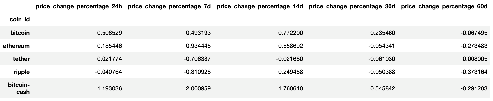

# CryptoClustering
Module 11 Challenge

## Background
In this Challenge, you’ll apply your understanding of the K-means algorithm and principal component analysis (PCA) to classify cryptocurrencies according to their price fluctuations across various timeframes. Specifically, you will examine price changes over intervals spanning 24 hours, 7 days, 30 days, 60 days, 200 days, and 1 year.

## Files

## Before You Begin
Before starting the assignment, be sure to complete the following steps:
   - [x] Create a new repository for this project called CryptoClustering. **Do not add this homework assignment to an existing repository.**
   - [x] Clone the new repository to your computer.
   - [x] Push these changes to GitHub or GitLab.

## Instructions

1. Rename the Crypto_Clustering_starter_code.ipynb file as Crypto_Clustering.ipynb.

2. Load the crypto_market_data.csv into a DataFrame and set the index to the “coin_id” column.

3. Get the summary statistics to see what the data looks like before proceeding.

## Prepare the Data

1. Use the StandardScaler() module from scikit-learn to normalize the data from the CSV file.

2. Create a DataFrame with the scaled data and set the "coin_id" index from the original DataFrame as the index for the new DataFrame.

    - The first five rows of the scaled DataFrame should appear as follows:

## Find the Best Value for k Using the Original Scaled DataFrame
Use the elbow method to find the best value for k by completing the following steps:

1. Create a list with the number of k values from 1 to 11.
2. Create an empty list to store the inertia values.
3. Create a for loop to compute the inertia with each possible value of k.
4. Create a dictionary with the data to plot the elbow curve.
5. Plot a line chart with all the inertia values computed with the different values of k to visually identify the optimal value for k.
6. Answer the following question in your notebook: What is the best value for k?

## Cluster Cryptocurrencies with K-Means Using the Original Scaled Data

Use the following steps to cluster the cryptocurrencies for the best value for k on the original scaled data:

1. Initialize the K-means model with the best value for k.
2. Create an instance of K-means, define the number of clusters based on the best value of k, and then fit the model using the original scaled DataFrame.
3. Predict the clusters to group the cryptocurrencies using the original scaled DataFrame.
4. Create a copy of the original data and add a new column with the predicted clusters.
5. Create a scatterplot using pandas’ plot as follows:
    - Set the x-axis as "price_change_percentage_24h" and the y-axis as "price_change_percentage_7d".

## Optimize Clusters with Principal Component Analysis

1. Using the original scaled DataFrame, perform a PCA and reduce the features to three principal components.

2. Retrieve the explained variance to determine how much information can be attributed to each principal component and then answer the following question in your notebook:

    - What is the total explained variance of the three principal components?
3. Create a new DataFrame with the PCA data and set the "coin_id" index from the original DataFrame as the index for the new DataFrame.

    - The first five rows of the PCA DataFrame should appear as follows:
    

##  Find the Best Value for k Using the PCA Data 

Use the elbow method on the PCA data to find the best value for k using the following steps:

1. Create a list with the number of k-values from 1 to 11.
2. Create an empty list to store the inertia values.
3. Create a for loop to compute the inertia with each possible value of k.
4. Create a dictionary with the data to plot the elbow curve.
5. Plot a line chart with all the inertia values computed with the different values of k to visually identify the optimal value for k.
6. Answer the following questions in your notebook:
    - What is the best value for k when using the PCA data?
    - Does it differ from the best k-value found using the original data?

## Cluster Cryptocurrencies with K-Means Using the PCA Data

Use the following steps to cluster the cryptocurrencies for the best value for k on the PCA data:

1. Initialize the K-means model with the best value for k.
2. Create an instance of K-means, define the number of clusters based on the best value of k, and then fit the model using the PCA data.
3. Predict the clusters to group the cryptocurrencies using the PCA data.
4. Create a copy of the DataFrame with the PCA data and add a new column to store the predicted clusters.
5. Create a scatte rplot using pandas’ plot as follows:
    - Set the x-axis as "PC1" and the y-axis as "PC2".
6. Answer the following question:
    - What is the impact of using fewer features to cluster the data using K-Means?

## Determine the Weights of Each Feature on Each Principal Component

1. Create a DataFrame that shows the weights of each feature (column) for each principal component by using the columns from the original scaled DataFrame as the index.

2. Which features have the strongest positive or negative influence on each component?
To that end, you want to mine the search traffic data for predictable seasonal patterns of interest in the company. To do so, complete the following steps:

## Badges

## Visuals

## Installation

## Usage

## Support
Some of the code on this assigment was done with the help of a bootcamp tutor.

## Roadmap

## Contributing

## Authors and acknowledgment
1. Reference material - [PEP 8 – Style Guide for Python Code](https://peps.python.org/pep-0008/)
2. Python HOWTOs - [https://docs.python.org/3/howto](https://docs.python.org/3/howto/index.html)
3. This site was built using [GitHub Pages](https://pages.github.com/)

## License
THE SOFTWARE IS PROVIDED "AS IS", WITHOUT WARRANTY OF ANY KIND, EXPRESS OR
IMPLIED, INCLUDING BUT NOT LIMITED TO THE WARRANTIES OF MERCHANTABILITY,
FITNESS FOR A PARTICULAR PURPOSE AND NONINFRINGEMENT. IN NO EVENT SHALL THE
AUTHORS OR COPYRIGHT HOLDERS BE LIABLE FOR ANY CLAIM, DAMAGES OR OTHER
LIABILITY, WHETHER IN AN ACTION OF CONTRACT, TORT OR OTHERWISE, ARISING FROM,
OUT OF OR IN CONNECTION WITH THE SOFTWARE OR THE USE OR OTHER DEALINGS IN THE
SOFTWARE.

## Project status
- Submitted for grading (06.03.2024)

## Footnotes